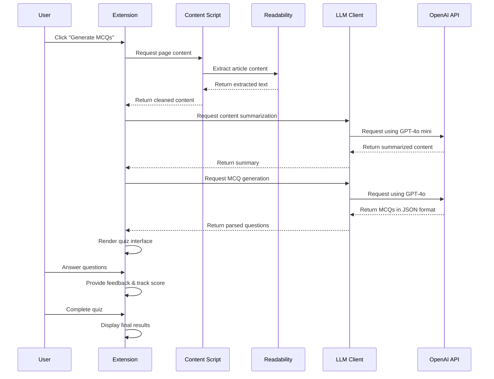

# Quizr: MCQ Generator Chrome Extension

## Table of Contents
- [Overview](#overview)
- [Features](#features)
- [Technical Architecture](#technical-architecture)
  - [Data Flow](#data-flow)
  - [Workflow](#workflow)
  - [Technical Specifications](#technical-specifications)
  - [Security Considerations](#security-considerations)
  - [Performance Optimizations](#performance-optimizations)
- [Installation](#installation)
  - [Manual Installation](#manual-installation)
- [Setup](#setup)
- [Usage](#usage)
- [Privacy](#privacy)

## Overview

The MCQ Generator is a Chrome extension that transforms webpage content into interactive multiple-choice questions using OpenAI's GPT-4o models. It extracts content from any webpage, summarizes it using AI, and generates contextually relevant questions to help users test their understanding of the material.

## Features

- Extract content from any webpage
- Generate multiple-choice questions based on the content directly using the OpenAI API
- Uses GPT-4o mini for content summarization and GPT-4o for question generation
- Interactive quiz interface with instant feedback
- Score tracking and progress indicators
- Explanation for each question

## Technical Architecture

### Data Flow

1. **Content Extraction**:
   - Content is extracted from the active webpage using Readability
   - Text is cleaned and sanitized to remove HTML and excess whitespace

2. **Content Summarization**:
   - The cleaned content is sent to OpenAI's GPT-4o mini model
   - The model identifies and extracts the 5 most important sentences

3. **Question Generation**:
   - The summary is sent to OpenAI's GPT-4o model
   - A structured prompt requests questions in a specific JSON format
   - Each question includes: question text, 4 options, correct answer, and source sentence

4. **Quiz Presentation**:
   - Questions are rendered in an interactive interface
   - User answers are validated in real-time
   - Progress is tracked and persisted

### Workflow

### Technical Specifications

- **Extension Framework**: Chrome Extension Manifest V3
- **UI Framework**: Bootstrap 5 for responsive design
- **AI Models**:
  - GPT-4o mini for summarization (efficient, cost-effective)
  - GPT-4o for question generation (high quality, complex reasoning)
- **Storage**:
  - chrome.storage.sync for API key (synced across devices)
  - chrome.storage.local for quiz state (device-specific)
- **Content Extraction**: Mozilla's Readability.js + DOMPurify

### Security Considerations

- API key is stored locally in Chrome's secure storage
- No backend server - all API calls go directly from browser to OpenAI
- Content is processed client-side where possible
- No tracking or data collection

### Performance Optimizations

- Two-stage AI processing:
  1. Efficient summarization with smaller model (GPT-4o mini)
  2. High-quality question generation with more powerful model (GPT-4o)
- Progressive loading UI with step indicators
- Persistent quiz state to handle popup closing/reopening

## Installation

### Manual Installation

1. Clone this repository
2. Open Chrome and navigate to `chrome://extensions/`
3. Enable "Developer mode" in the top right
4. Click "Load unpacked" and select the `extension` folder from this repository

## Setup

After installing the extension, you'll need to provide your own OpenAI API key:

1. Click the extension icon in your browser toolbar
2. Click the settings icon (⚙️) in the top right corner
3. Enter your OpenAI API key and select your preferred model
4. Click "Save Settings"

You can get an OpenAI API key from [https://platform.openai.com/api-keys](https://platform.openai.com/api-keys)

## Usage

1. Navigate to any webpage with content you want to test yourself on
2. Click the extension icon in your browser toolbar
3. Click "Generate MCQs"
4. Answer the questions and see your results!

## Privacy

This extension:
- Stores your OpenAI API key locally in your browser
- Sends webpage content to OpenAI's API for processing
- Does not collect or store any user data

Your API key and content are transmitted directly from your browser to OpenAI. No data is sent to our servers.